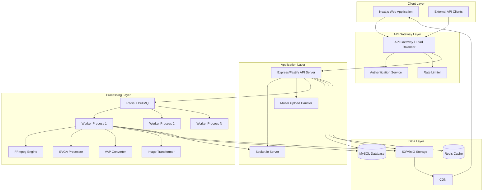

# Design Document: SVGA Animation Platform

## Overview

The SVGA Animation Platform is a production-ready SaaS application built on a modern microservices-inspired architecture. The system separates concerns into three primary layers: a Next.js frontend for user interaction, a Node.js API layer for business logic and orchestration, and a distributed worker layer for heavy processing tasks. The platform leverages industry-standard tools including FFmpeg for video processing, Redis/BullMQ for job queuing, Prisma ORM for database access, and S3-compatible storage for file management.

The design prioritizes scalability, reliability, and user experience. Real-time progress updates via Socket.io keep users informed during long-running operations. The job queue system with automatic retries ensures processing reliability. Role-based access control and tiered subscriptions enable flexible monetization while maintaining security.

## Architecture

### High-Level System Architecture



### Component Responsibilities

**Client Layer:**
- **Next.js Web Application**: Server-side rendered React application providing the user interface, including the Konva.js-based animation editor, project management, template marketplace, and real-time job progress monitoring
- **External API Clients**: Third-party applications integrating with the platform via REST API

**API Gateway Layer:**
- **API Gateway / Load Balancer**: Routes requests, handles SSL termination, and distributes load across API server instances
- **Authentication Service**: JWT-based authentication and session management
- **Rate Limiter**: Token bucket algorithm enforcing per-user and per-API-key rate limits

**Application Layer:**
- **Express/Fastify API Server**: RESTful API handling business logic, request validation, database operations, and job submission
- **Socket.io Server**: WebSocket server providing real-time bidirectional communication for job progress updates
- **Multer Upload Handler**: Multipart form data parser for file uploads with size validation and temporary storage

**Processing Layer:**
- **Redis + BullMQ**: Distributed job queue with priority support, automatic retries, and job persistence
- **Worker Processes**: Horizontally scalable background processes consuming jobs from the queue
- **FFmpeg Engine**: Video encoding, decoding, and transformation for VAP conversion
- **SVGA Processor**: Parser and serializer for SVGA v1.0 and v2.0 file formats
- **VAP Converter**: MP4 to VAP format converter optimized for mobile playback
- **Image Transformer**: Static image to SVGA animation converter with configurable effects

**Data Layer:**
- **MySQL Database**: Primary relational database storing users, projects, jobs, templates, transactions, and metadata
- **Redis Cache**: In-memory cache for session data, rate limiting counters, and frequently accessed data
- **S3/MinIO Storage**: Object storage for uploaded files, processed outputs, and template assets
- **CDN**: Content delivery network for static assets and public files

### Data Flow Patterns

**Synchronous Request Flow (Project Save):**
1. User saves project in Editor_Canvas
2. Next.js app sends POST request to API server
3. API server validates request and authenticates user
4. API server writes project data to MySQL via Prisma
5. API server returns success response
6. Next.js app updates UI state

**Asynchronous Job Flow (Video to VAP Conversion):**
1. User uploads MP4 file via Next.js app
2. Multer handler stores file temporarily and validates size
3. API server creates job record in MySQL
4. API server enqueues job in BullMQ with job ID
5. API server returns job ID to client
6. Client establishes Socket.io connection for job updates
7. Available worker picks up job from queue
8. Worker downloads MP4 from S3
9. Worker processes video with FFmpeg, emitting progress via Socket.io
10. Worker uploads VAP file to S3
11. Worker updates job status in MySQL
12. Worker emits completion event via Socket.io with download URL
13. Client receives completion and displays download link

## Components and Interfaces

### Frontend Components

#### Animation Editor (Konva.js Canvas)

**Purpose**: Visual canvas-based editor for manipulating animation layers and frames

**Key Features**:
- Layer selection, dragging, and z-index reordering
- Frame-by-frame editing with timeline scrubber
- Real-time preview at 60fps
- Undo/redo stack (50 actions)
- Zoom and pan controls
- Layer visibility toggles
- Property inspector for selected layers

**State Management (Zustand)**:
```typescript
interface EditorStore {
  project: Project | null;
  selectedLayerId: string | null;
  currentFrame: number;
  layers: Layer[];
  undoStack: EditorAction[];
  redoStack: EditorAction[];
  isPlaying: boolean;
  zoom: number;
  
  // Actions
  selectLayer: (layerId: string) => void;
  updateLayer: (layerId: string, updates: Partial<Layer>) => void;
  addLayer: (layer: Layer) => void;
  deleteLayer: (layerId: string) => void;
  undo: () => void;
  redo: () => void;
  setFrame: (frame: number) => void;
  play: () => void;
  pause: () => void;
}
```

**Performance Optimizations**:
- Layer virtualization for projects with >50 layers
- Canvas rendering throttled to 60fps
- Debounced auto-save (30 second intervals)
- Lazy loading of frame images
- Web Workers for heavy computations

#### Job Progress Monitor

**Purpose**: Real-time display of processing job status

**Socket.io Event Handlers**:
```typescript
socket.on('job:progress', (data: { jobId: string; progress: number; message: string }) => {
  updateJobProgress(data.jobId, data.progress, data.message);
});

socket.on('job:completed', (data: { jobId: string; downloadUrl: string }) => {
  showCompletionNotification(data.jobId, data.downloadUrl);
});

socket.on('job:failed', (data: { jobId: string; error: string }) => {
  showErrorNotification(data.jobId, data.error);
});
```

**Reconnection Logic**:
- Exponential backoff: 1s, 2s, 4s, 8s, 16s
- Maximum 5 reconnection attempts
- Resume job monitoring after reconnection using job ID

#### Template Marketplace

**Purpose**: Browse, preview, and purchase animation templates

**Features**:
- Grid layout with lazy-loaded template cards
- Animated preview on hover (MP4 preview)
- Filter by category, price range, and popularity
- Search by keywords
- Purchase flow with payment integration
- Download purchased templates

### Backend API Endpoints

#### Authentication Endpoints

```
POST /api/auth/register
Body: { email, password, name }
Response: { user, token }

POST /api/auth/login
Body: { email, password }
Response: { user, token }

POST /api/auth/logout
Headers: Authorization: Bearer <token>
Response: { success: true }

GET /api/auth/me
Headers: Authorization: Bearer <token>
Response: { user }
```

#### Project Endpoints

```
GET /api/projects
Headers: Authorization: Bearer <token>
Query: ?page=1&limit=20
Response: { projects: Project[], total: number, page: number }

GET /api/projects/:id
Headers: Authorization: Bearer <token>
Response: { project: Project }

POST /api/projects
Headers: Authorization: Bearer <token>
Body: { name, description, data: { layers, frames } }
Response: { project: Project }

PUT /api/projects/:id
Headers: Authorization: Bearer <token>
Body: { name?, description?, data? }
Response: { project: Project }

DELETE /api/projects/:id
Headers: Authorization: Bearer <token>
Response: { success: true }
```

#### File Upload Endpoints

```
POST /api/upload/svga
Headers: Authorization: Bearer <token>
Content-Type: multipart/form-data
Body: file (max 100MB)
Response: { fileId, url, metadata: { version, layers, frames } }

POST /api/upload/video
Headers: Authorization: Bearer <token>
Content-Type: multipart/form-data
Body: file (max 500MB)
Response: { fileId, url }

POST /api/upload/image
Headers: Authorization: Bearer <token>
Content-Type: multipart/form-data
Body: file (max 50MB)
Response: { fileId, url }
```

#### Job Endpoints

```
POST /api/jobs/convert-to-vap
Headers: Authorization: Bearer <token>
Body: { fileId, options: { quality, fps } }
Response: { jobId, status: 'queued' }

POST /api/jobs/image-to-svga
Headers: Authorization: Bearer <token>
Body: { fileId, animationType: 'fade-in' | 'slide' | 'scale' | 'rotate', duration: number }
Response: { jobId, status: 'queued' }

POST /api/jobs/batch-compress
Headers: Authorization: Bearer <token>
Body: { fileIds: string[], compressionLevel: number }
Response: { batchId, jobIds: string[] }

GET /api/jobs/:id
Headers: Authorization: Bearer <token>
Response: { job: Job }

GET /api/jobs
Headers: Authorization: Bearer <token>
Query: ?status=completed&page=1&limit=20
Response: { jobs: Job[], total: number }
```

#### Template Endpoints

```
GET /api/templates
Query: ?category=effects&minPrice=0&maxPrice=50&page=1&limit=20
Response: { templates: Template[], total: number }

GET /api/templates/:id
Response: { template: Template }

POST /api/templates/:id/purchase
Headers: Authorization: Bearer <token>
Body: { paymentMethodId }
Response: { transaction: Transaction, downloadUrl: string }

GET /api/templates/purchased
Headers: Authorization: Bearer <token>
Response: { templates: Template[] }

POST /api/templates (Admin/Creator only)
Headers: Authorization: Bearer <token>
Content-Type: multipart/form-data
Body: { title, description, price, category, file, preview }
Response: { template: Template }
```

#### Export Endpoints

```
POST /api/export/:projectId
Headers: Authorization: Bearer <token>
Body: { format: 'svga' | 'vap', quality: number }
Response: { jobId, status: 'queued' }

GET /api/export/download/:jobId
Headers: Authorization: Bearer <token>
Response: Redirect to signed S3 URL (24 hour expiry)
```

### Worker Processing Components

#### SVGA Processor

**Purpose**: Parse and serialize SVGA v1.0 and v2.0 files

**Interface**:
```typescript
interface SVGAProcessor {
  parse(buffer: Buffer): Promise<SVGAData>;
  serialize(data: SVGAData): Promise<Buffer>;
  validate(data: SVGAData): ValidationResult;
  convertVersion(data: SVGAData, targetVersion: '1.0' | '2.0'): SVGAData;
}

interface SVGAData {
  version: '1.0' | '2.0';
  videoSize: { width: number; height: number };
  fps: number;
  frames: number;
  layers: SVGALayer[];
}

interface SVGALayer {
  id: string;
  name: string;
  frames: SVGAFrame[];
  transform: Transform;
}

interface SVGAFrame {
  index: number;
  alpha: number;
  layout: { x: number; y: number; width: number; height: number };
  transform: Transform;
  imageKey?: string;
}

interface Transform {
  a: number; b: number; c: number; d: number; tx: number; ty: number;
}
```

**Implementation Details**:
- Uses Protocol Buffers for SVGA v2.0 parsing
- Uses JSON parsing for SVGA v1.0
- Validates layer count, frame count, and image references
- Extracts embedded images and stores separately in S3
- Maintains layer order and transform matrices

#### VAP Converter

**Purpose**: Convert MP4 videos to VAP format optimized for mobile

**Interface**:
```typescript
interface VAPConverter {
  convert(inputPath: string, outputPath: string, options: VAPOptions): Promise<VAPResult>;
}

interface VAPOptions {
  quality: number; // 1-100
  fps?: number; // Target frame rate
  maxWidth?: number;
  maxHeight?: number;
}

interface VAPResult {
  outputPath: string;
  originalSize: number;
  compressedSize: number;
  compressionRatio: number;
  duration: number;
  fps: number;
}
```

**FFmpeg Pipeline**:
1. Extract video stream from MP4
2. Extract alpha channel if present
3. Encode video stream with H.264 (mobile-optimized profile)
4. Encode alpha channel separately
5. Mux streams into VAP container format
6. Optimize for streaming (moov atom at beginning)

**FFmpeg Command Template**:
```bash
ffmpeg -i input.mp4 \
  -vf "scale='min(${maxWidth},iw)':'min(${maxHeight},ih)':force_original_aspect_ratio=decrease" \
  -c:v libx264 \
  -profile:v baseline \
  -level 3.0 \
  -preset medium \
  -crf ${quality} \
  -r ${fps} \
  -movflags +faststart \
  output.vap
```

#### Image Transformer

**Purpose**: Convert static images to SVGA animations

**Interface**:
```typescript
interface ImageTransformer {
  transform(imagePath: string, options: TransformOptions): Promise<SVGAData>;
}

interface TransformOptions {
  animationType: 'fade-in' | 'slide' | 'scale' | 'rotate';
  duration: number; // seconds
  fps: number;
  easing?: 'linear' | 'ease-in' | 'ease-out' | 'ease-in-out';
}
```

**Animation Implementations**:

**Fade-in**: Interpolate alpha from 0 to 1 over duration
```typescript
for (let frame = 0; frame < totalFrames; frame++) {
  const progress = frame / totalFrames;
  const alpha = easing(progress);
  frames.push({ index: frame, alpha, layout, transform: identity });
}
```

**Slide**: Interpolate position from off-screen to final position
```typescript
for (let frame = 0; frame < totalFrames; frame++) {
  const progress = frame / totalFrames;
  const x = startX + (endX - startX) * easing(progress);
  frames.push({ index: frame, alpha: 1, layout: { ...layout, x }, transform: identity });
}
```

**Scale**: Interpolate scale from 0 to 1
```typescript
for (let frame = 0; frame < totalFrames; frame++) {
  const progress = frame / totalFrames;
  const scale = easing(progress);
  const transform = { a: scale, b: 0, c: 0, d: scale, tx: 0, ty: 0 };
  frames.push({ index: frame, alpha: 1, layout, transform });
}
```

**Rotate**: Interpolate rotation from 0 to 360 degrees
```typescript
for (let frame = 0; frame < totalFrames; frame++) {
  const progress = frame / totalFrames;
  const angle = 2 * Math.PI * easing(progress);
  const transform = {
    a: Math.cos(angle), b: Math.sin(angle),
    c: -Math.sin(angle), d: Math.cos(angle),
    tx: 0, ty: 0
  };
  frames.push({ index: frame, alpha: 1, layout, transform });
}
```

#### Batch Compressor

**Purpose**: Compress multiple animation files efficiently

**Interface**:
```typescript
interface BatchCompressor {
  compressBatch(fileIds: string[], options: CompressionOptions): Promise<BatchResult>;
}

interface CompressionOptions {
  compressionLevel: number; // 1-10
  preserveQuality: boolean;
}

interface BatchResult {
  batchId: string;
  results: CompressionResult[];
  totalOriginalSize: number;
  totalCompressedSize: number;
  averageCompressionRatio: number;
}

interface CompressionResult {
  fileId: string;
  success: boolean;
  originalSize: number;
  compressedSize: number;
  compressionRatio: number;
  error?: string;
}
```

**Compression Strategy**:
1. Parse SVGA file
2. Optimize embedded images:
   - Convert PNG to WebP where supported
   - Reduce image dimensions if exceeding display size
   - Apply lossy compression based on compressionLevel
3. Remove duplicate images (hash-based deduplication)
4. Optimize transform matrices (round to 2 decimal places)
5. Remove unused frames and layers
6. Serialize with minimal whitespace

### Job Queue System

#### BullMQ Configuration

**Queue Definition**:
```typescript
const jobQueue = new Queue('animation-processing', {
  connection: {
    host: process.env.REDIS_HOST,
    port: process.env.REDIS_PORT,
  },
  defaultJobOptions: {
    attempts: 3,
    backoff: {
      type: 'exponential',
      delay: 2000,
    },
    removeOnComplete: {
      age: 86400, // 24 hours
      count: 1000,
    },
    removeOnFail: {
      age: 604800, // 7 days
    },
  },
});
```

**Job Types**:
```typescript
type JobType = 
  | 'convert-to-vap'
  | 'image-to-svga'
  | 'compress-svga'
  | 'generate-preview'
  | 'export-project'
  | 'apply-watermark';

interface JobData {
  type: JobType;
  userId: string;
  fileId?: string;
  projectId?: string;
  options: Record<string, any>;
  socketId?: string; // For progress updates
}
```

**Worker Implementation**:
```typescript
const worker = new Worker('animation-processing', async (job) => {
  const { type, userId, fileId, projectId, options, socketId } = job.data;
  
  // Emit progress helper
  const emitProgress = (progress: number, message: string) => {
    job.updateProgress(progress);
    if (socketId) {
      io.to(socketId).emit('job:progress', {
        jobId: job.id,
        progress,
        message,
      });
    }
  };
  
  try {
    switch (type) {
      case 'convert-to-vap':
        return await handleVAPConversion(job, emitProgress);
      case 'image-to-svga':
        return await handleImageTransform(job, emitProgress);
      case 'compress-svga':
        return await handleCompression(job, emitProgress);
      // ... other job types
    }
  } catch (error) {
    // Log error and update job status
    await logError(job.id, error);
    throw error; // BullMQ will handle retry
  }
}, {
  connection: {
    host: process.env.REDIS_HOST,
    port: process.env.REDIS_PORT,
  },
  concurrency: 5, // Process 5 jobs concurrently per worker
});

worker.on('completed', async (job, result) => {
  // Update database
  await prisma.job.update({
    where: { id: job.id },
    data: { status: 'completed', result, completedAt: new Date() },
  });
  
  // Emit completion event
  if (job.data.socketId) {
    io.to(job.data.socketId).emit('job:completed', {
      jobId: job.id,
      downloadUrl: result.downloadUrl,
    });
  }
});

worker.on('failed', async (job, error) => {
  // Update database
  await prisma.job.update({
    where: { id: job.id },
    data: { status: 'failed', error: error.message, completedAt: new Date() },
  });
  
  // Emit failure event
  if (job.data.socketId) {
    io.to(job.data.socketId).emit('job:failed', {
      jobId: job.id,
      error: error.message,
    });
  }
});
```

**Scaling Strategy**:
- Horizontal scaling: Deploy multiple worker processes across servers
- Auto-scaling: Monitor queue length and spawn/terminate workers dynamically
- Priority queues: Separate queues for premium users with higher priority
- Job timeout: 30 minutes maximum per job

## Data Models

### Database Schema (Prisma)

```prisma
// User and Authentication
model User {
  id            String    @id @default(uuid())
  email         String    @unique
  passwordHash  String
  name          String
  role          Role      @default(FREE_TIER)
  apiKey        String?   @unique
  createdAt     DateTime  @default(now())
  updatedAt     DateTime  @updatedAt
  
  projects      Project[]
  jobs          Job[]
  transactions  Transaction[]
  templates     Template[]
  
  // Subscription
  subscriptionId       String?
  subscriptionStatus   SubscriptionStatus?
  subscriptionEndsAt   DateTime?
  
  // Storage quota
  storageUsed   BigInt    @default(0) // bytes
  
  @@index([email])
  @@index([apiKey])
}

enum Role {
  FREE_TIER
  PREMIUM
  ADMIN
}

enum SubscriptionStatus {
  ACTIVE
  CANCELED
  PAST_DUE
  EXPIRED
}

// Projects
model Project {
  id          String    @id @default(uuid())
  userId      String
  user        User      @relation(fields: [userId], references: [id], onDelete: Cascade)
  name        String
  description String?
  data        Json      // Stores layers, frames, and editor state
  thumbnail   String?   // S3 URL
  createdAt   DateTime  @default(now())
  updatedAt   DateTime  @updatedAt
  
  @@index([userId])
  @@index([createdAt])
}

// Jobs
model Job {
  id          String    @id @default(uuid())
  userId      String
  user        User      @relation(fields: [userId], references: [id], onDelete: Cascade)
  type        JobType
  status      JobStatus @default(QUEUED)
  progress    Int       @default(0) // 0-100
  inputFileId String?
  outputFileId String?
  options     Json?
  result      Json?
  error       String?
  createdAt   DateTime  @default(now())
  startedAt   DateTime?
  completedAt DateTime?
  
  @@index([userId])
  @@index([status])
  @@index([createdAt])
}

enum JobType {
  CONVERT_TO_VAP
  IMAGE_TO_SVGA
  COMPRESS_SVGA
  GENERATE_PREVIEW
  EXPORT_PROJECT
  APPLY_WATERMARK
}

enum JobStatus {
  QUEUED
  PROCESSING
  COMPLETED
  FAILED
  TIMEOUT
}

// Files
model File {
  id          String    @id @default(uuid())
  userId      String
  type        FileType
  originalName String
  storagePath String    // S3 key
  storageUrl  String    // S3 URL
  size        BigInt    // bytes
  mimeType    String
  metadata    Json?     // SVGA version, dimensions, etc.
  createdAt   DateTime  @default(now())
  lastAccessedAt DateTime @default(now())
  
  @@index([userId])
  @@index([lastAccessedAt]) // For archival
}

enum FileType {
  SVGA
  VAP
  MP4
  PNG
  JPG
  SVG
  ZIP
}

// Templates
model Template {
  id          String    @id @default(uuid())
  creatorId   String
  creator     User      @relation(fields: [creatorId], references: [id])
  title       String
  description String
  category    String
  price       Decimal   @db.Decimal(10, 2)
  fileId      String    // Reference to File
  previewUrl  String    // MP4 preview
  thumbnail   String
  downloads   Int       @default(0)
  rating      Decimal?  @db.Decimal(3, 2)
  isPublished Boolean   @default(false)
  createdAt   DateTime  @default(now())
  updatedAt   DateTime  @updatedAt
  
  transactions Transaction[]
  
  @@index([category])
  @@index([price])
  @@index([createdAt])
}

// Transactions
model Transaction {
  id          String    @id @default(uuid())
  userId      String
  user        User      @relation(fields: [userId], references: [id])
  templateId  String?
  template    Template? @relation(fields: [templateId], references: [id])
  type        TransactionType
  amount      Decimal   @db.Decimal(10, 2)
  currency    String    @default("USD")
  status      TransactionStatus
  paymentMethodId String?
  createdAt   DateTime  @default(now())
  
  @@index([userId])
  @@index([createdAt])
}

enum TransactionType {
  TEMPLATE_PURCHASE
  SUBSCRIPTION
  REFUND
}

enum TransactionStatus {
  PENDING
  COMPLETED
  FAILED
  REFUNDED
}

// Idempotency for batch operations
model IdempotencyKey {
  key         String    @id
  userId      String
  response    Json
  createdAt   DateTime  @default(now())
  expiresAt   DateTime
  
  @@index([expiresAt]) // For cleanup
}

// API Rate Limiting
model RateLimit {
  id          String    @id @default(uuid())
  identifier  String    // userId or apiKey
  endpoint    String
  count       Int
  windowStart DateTime
  
  @@unique([identifier, endpoint, windowStart])
  @@index([windowStart]) // For cleanup
}
```

### File Storage Organization

**S3 Bucket Structure**:
```
svga-platform-storage/
├── users/
│   └── {userId}/
│       ├── uploads/
│       │   └── {fileId}.{ext}
│       ├── projects/
│       │   └── {projectId}/
│       │       ├── data.json
│       │       ├── thumbnail.png
│       │       └── assets/
│       │           └── {assetId}.{ext}
│       └── exports/
│           └── {jobId}.{ext}
├── templates/
│   └── {templateId}/
│       ├── file.svga
│       ├── preview.mp4
│       └── thumbnail.png
└── temp/
    └── {jobId}/
        └── {tempFile}
```

**Storage Lifecycle Policies**:
- Temp files: Delete after 24 hours
- User uploads not accessed for 90 days: Move to Glacier
- Completed job outputs: Delete after 7 days if not downloaded
- Template files: Never expire

## Correctness Properties

*A property is a characteristic or behavior that should hold true across all valid executions of a system—essentially, a formal statement about what the system should do. Properties serve as the bridge between human-readable specifications and machine-verifiable correctness guarantees.*

Before writing the correctness properties, I need to analyze the acceptance criteria to determine which are suitable for property-based testing.


### Property Reflection

After analyzing the acceptance criteria, I identified the following properties. Now I'll review them for redundancy:

**Identified Properties:**
1. SVGA round-trip (3.4) - serialize then parse produces equivalent representation
2. Layer properties preserved in round-trip (3.5) - covered by property 1
3. Frame count preserved in round-trip (3.6) - covered by property 1
4. Compression reduces file size (22.1, 7.3)
5. Frame rate preserved during compression (7.5) - part of invariants
6. Duration preserved during compression (7.5, 22.3) - part of invariants
7. Frame count preserved during compression (22.2) - part of invariants
8. Compression idempotence (22.4) - compress twice = compress once
9. Batch operation idempotency (20.1, 20.2, 20.4)
10. Undo/redo round-trip (4.5, 4.6) - undo then redo restores state
11. VAP conversion size reduction (5.7)
12. Image transform produces valid SVGA (6.4)
13. Watermark present in all frames (11.4)
14. Validation properties (21.3, 21.4, 21.5) - can be combined
15. Export manifest completeness (25.2)

**Redundancy Analysis:**
- Properties 2 and 3 are subsumed by property 1 (round-trip) - they test specific aspects that should be covered by the general round-trip property
- Properties 5, 6, 7 can be combined into a single "compression preserves animation properties" invariant
- Properties 1 and 2 from batch idempotency (20.1, 20.2) can be combined - they both test that duplicate requests are handled correctly
- Validation properties (14) can be combined into a single comprehensive validation property

**Final Property Set:**
1. SVGA serialization round-trip
2. Compression reduces file size (metamorphic)
3. Compression preserves animation properties (invariant)
4. Compression idempotence
5. Batch operation idempotency
6. Undo/redo round-trip
7. VAP conversion size reduction (metamorphic)
8. Image transform output validity
9. Watermark invariant
10. Animation validation
11. Export manifest completeness

### Property 1: SVGA Serialization Round-Trip

*For any* valid SVGA internal representation, serializing it to a file and then parsing that file SHALL produce an equivalent internal representation with all layer properties, frame counts, and transform matrices preserved.

**Validates: Requirements 3.4, 3.5, 3.6**

### Property 2: Compression Reduces File Size

*For any* animation file, compressing it SHALL produce an output file with size strictly less than the input file size.

**Validates: Requirements 22.1, 7.3**

### Property 3: Compression Preserves Animation Properties

*For any* animation file, compressing it SHALL preserve the frame count, frame rate, and total duration of the animation (these properties remain invariant).

**Validates: Requirements 22.2, 22.3, 7.5**

### Property 4: Compression Idempotence

*For any* animation file, applying compression twice SHALL produce the same result as applying compression once (compress(compress(x)) ≡ compress(x)).

**Validates: Requirements 22.4**

### Property 5: Batch Operation Idempotency

*For any* batch operation request with an idempotency key, submitting the request multiple times SHALL execute the operation only once and return the same result for all duplicate requests.

**Validates: Requirements 20.1, 20.2, 20.4**

### Property 6: Undo/Redo Round-Trip

*For any* sequence of editor actions, applying undo followed by redo SHALL restore the editor state to the state immediately after the original action (redo(undo(state)) ≡ state).

**Validates: Requirements 4.5, 4.6**

### Property 7: VAP Conversion Size Reduction

*For any* MP4 video file, converting it to VAP format SHALL produce an output file that is at least 30% smaller than the input file.

**Validates: Requirements 5.7**

### Property 8: Image Transform Output Validity

*For any* valid image file (PNG, JPG, SVG), transforming it to SVGA format SHALL produce a valid SVGA file that can be successfully parsed by the SVGA_Processor.

**Validates: Requirements 6.4**

### Property 9: Watermark Invariant

*For any* animation exported by a free tier user, the watermark SHALL be present and visible in every frame of the exported animation.

**Validates: Requirements 11.4**

### Property 10: Animation Validation

*For any* animation, validation SHALL correctly identify whether the frame rate is between 1-60 fps, duration is ≤60 seconds, and layer count is ≤100 layers, rejecting animations that violate any constraint.

**Validates: Requirements 21.3, 21.4, 21.5**

### Property 11: Export Manifest Completeness

*For any* set of projects being exported, the generated manifest file SHALL contain an entry for each project with complete metadata including project ID, name, file paths, and timestamps.

**Validates: Requirements 25.2**

## Error Handling

### Error Categories

**Client Errors (4xx)**:
- 400 Bad Request: Invalid input data, malformed requests
- 401 Unauthorized: Missing or invalid authentication token
- 403 Forbidden: Insufficient permissions for requested resource
- 404 Not Found: Resource does not exist
- 409 Conflict: Resource conflict (e.g., duplicate idempotency key with different data)
- 413 Payload Too Large: File size exceeds limits
- 422 Unprocessable Entity: Validation errors
- 429 Too Many Requests: Rate limit exceeded

**Server Errors (5xx)**:
- 500 Internal Server Error: Unexpected server error
- 502 Bad Gateway: Upstream service unavailable
- 503 Service Unavailable: Server overloaded or maintenance
- 504 Gateway Timeout: Upstream service timeout

### Error Response Format

```typescript
interface ErrorResponse {
  error: {
    code: string; // Machine-readable error code
    message: string; // Human-readable error message
    details?: any; // Additional error context
    timestamp: string;
    requestId: string; // For support tracking
  };
}
```

**Example Error Responses**:

```json
{
  "error": {
    "code": "FILE_TOO_LARGE",
    "message": "Uploaded file exceeds maximum size of 100MB",
    "details": {
      "maxSize": 104857600,
      "actualSize": 157286400
    },
    "timestamp": "2024-01-15T10:30:00Z",
    "requestId": "req_abc123"
  }
}
```

```json
{
  "error": {
    "code": "SVGA_PARSE_ERROR",
    "message": "Failed to parse SVGA file",
    "details": {
      "line": 42,
      "column": 15,
      "reason": "Invalid layer transform matrix"
    },
    "timestamp": "2024-01-15T10:30:00Z",
    "requestId": "req_def456"
  }
}
```

### Error Handling Strategies

**Database Connection Failures**:
```typescript
async function withRetry<T>(
  operation: () => Promise<T>,
  maxAttempts: number = 3,
  delayMs: number = 1000
): Promise<T> {
  for (let attempt = 1; attempt <= maxAttempts; attempt++) {
    try {
      return await operation();
    } catch (error) {
      if (attempt === maxAttempts) throw error;
      if (!isRetryableError(error)) throw error;
      
      await sleep(delayMs * attempt); // Exponential backoff
    }
  }
  throw new Error('Max retry attempts exceeded');
}

function isRetryableError(error: any): boolean {
  return (
    error.code === 'ECONNREFUSED' ||
    error.code === 'ETIMEDOUT' ||
    error.message.includes('Connection lost')
  );
}
```

**Storage Service Failures**:
```typescript
class StorageService {
  private uploadQueue: Queue<UploadTask> = new Queue();
  
  async uploadFile(file: Buffer, key: string): Promise<string> {
    try {
      return await this.s3.upload(file, key);
    } catch (error) {
      if (this.isStorageUnavailable(error)) {
        // Queue for retry
        this.uploadQueue.enqueue({ file, key, attempts: 0 });
        this.startRetryWorker();
        throw new StorageUnavailableError('Storage service unavailable, upload queued for retry');
      }
      throw error;
    }
  }
  
  private startRetryWorker() {
    if (this.retryWorkerRunning) return;
    
    this.retryWorkerRunning = true;
    setInterval(async () => {
      while (!this.uploadQueue.isEmpty()) {
        const task = this.uploadQueue.peek();
        try {
          await this.s3.upload(task.file, task.key);
          this.uploadQueue.dequeue();
        } catch (error) {
          task.attempts++;
          if (task.attempts >= 10) {
            // Give up after 10 minutes
            this.uploadQueue.dequeue();
            logger.error('Upload failed after max retries', { key: task.key });
          }
          break; // Wait for next interval
        }
      }
    }, 60000); // Retry every 60 seconds
  }
}
```

**Worker Crash Detection**:
```typescript
// BullMQ automatically handles worker crashes through stalled job detection
const worker = new Worker('animation-processing', processJob, {
  stalledInterval: 30000, // Check for stalled jobs every 30 seconds
  maxStalledCount: 3, // Fail job after 3 stalled detections
});

worker.on('stalled', (jobId) => {
  logger.warn('Job stalled, will be reassigned', { jobId });
});
```

**Graceful Degradation**:
- If CDN is unavailable, serve assets directly from S3 (slower but functional)
- If Socket.io connection fails, fall back to polling for job status
- If preview generation fails, display placeholder image
- If watermark application fails, log error but complete export (watermark is non-critical for system operation)

### Logging Strategy

**Log Levels**:
- ERROR: System errors requiring immediate attention
- WARN: Potential issues that don't prevent operation
- INFO: Important business events (user registration, job completion)
- DEBUG: Detailed diagnostic information

**Structured Logging Format**:
```typescript
interface LogEntry {
  level: 'ERROR' | 'WARN' | 'INFO' | 'DEBUG';
  timestamp: string;
  message: string;
  context: {
    userId?: string;
    jobId?: string;
    requestId?: string;
    duration?: number;
    [key: string]: any;
  };
  error?: {
    name: string;
    message: string;
    stack: string;
  };
}
```

**Critical Error Alerting**:
```typescript
class AlertService {
  async sendCriticalAlert(error: Error, context: any) {
    // Send to multiple channels for redundancy
    await Promise.allSettled([
      this.sendSlackAlert(error, context),
      this.sendPagerDutyAlert(error, context),
      this.sendEmailAlert(error, context),
    ]);
  }
  
  private shouldAlert(error: Error): boolean {
    return (
      error instanceof DatabaseConnectionError ||
      error instanceof StorageServiceError ||
      error.message.includes('CRITICAL') ||
      this.errorRateExceedsThreshold()
    );
  }
}
```

## Testing Strategy

### Testing Approach

The SVGA Animation Platform requires a comprehensive testing strategy that combines multiple testing methodologies to ensure correctness, reliability, and performance. The testing approach includes:

1. **Property-Based Testing**: For core algorithms and data transformations where universal properties can be verified across many generated inputs
2. **Unit Testing**: For specific business logic, edge cases, and component behavior
3. **Integration Testing**: For API endpoints, database operations, and service interactions
4. **End-to-End Testing**: For critical user workflows through the full stack
5. **Performance Testing**: For response times, throughput, and resource usage
6. **Security Testing**: For authentication, authorization, and input validation

### Property-Based Testing

**Framework**: fast-check (JavaScript/TypeScript property-based testing library)

**Configuration**: Each property test MUST run a minimum of 100 iterations to ensure comprehensive input coverage.

**Property Test Implementation**:

Each correctness property from the design document will be implemented as a property-based test with the following structure:

```typescript
import fc from 'fast-check';

describe('Feature: svga-animation-platform, Property 1: SVGA Serialization Round-Trip', () => {
  it('should preserve all data through serialize-parse cycle', () => {
    fc.assert(
      fc.property(
        svgaDataArbitrary(), // Generator for random SVGA data
        (svgaData) => {
          // Feature: svga-animation-platform, Property 1: SVGA Serialization Round-Trip
          const serialized = svgaProcessor.serialize(svgaData);
          const parsed = svgaProcessor.parse(serialized);
          
          expect(parsed).toEqual(svgaData);
          expect(parsed.layers).toHaveLength(svgaData.layers.length);
          expect(parsed.frames).toBe(svgaData.frames);
        }
      ),
      { numRuns: 100 }
    );
  });
});
```

**Generators (Arbitraries)**:

```typescript
// Generator for valid SVGA data
function svgaDataArbitrary(): fc.Arbitrary<SVGAData> {
  return fc.record({
    version: fc.constantFrom('1.0', '2.0'),
    videoSize: fc.record({
      width: fc.integer({ min: 1, max: 4096 }),
      height: fc.integer({ min: 1, max: 4096 }),
    }),
    fps: fc.integer({ min: 1, max: 60 }),
    frames: fc.integer({ min: 1, max: 300 }),
    layers: fc.array(svgaLayerArbitrary(), { minLength: 1, maxLength: 100 }),
  });
}

function svgaLayerArbitrary(): fc.Arbitrary<SVGALayer> {
  return fc.record({
    id: fc.uuid(),
    name: fc.string({ minLength: 1, maxLength: 50 }),
    frames: fc.array(svgaFrameArbitrary(), { minLength: 1, maxLength: 300 }),
    transform: transformArbitrary(),
  });
}

function transformArbitrary(): fc.Arbitrary<Transform> {
  return fc.record({
    a: fc.float({ min: -10, max: 10 }),
    b: fc.float({ min: -10, max: 10 }),
    c: fc.float({ min: -10, max: 10 }),
    d: fc.float({ min: -10, max: 10 }),
    tx: fc.float({ min: -1000, max: 1000 }),
    ty: fc.float({ min: -1000, max: 1000 }),
  });
}

// Generator for animation files (for compression tests)
function animationFileArbitrary(): fc.Arbitrary<Buffer> {
  return svgaDataArbitrary().map(data => svgaProcessor.serialize(data));
}
```

**Property Test Tags**:

Each property test MUST include a comment tag referencing the design document property:

```typescript
// Feature: svga-animation-platform, Property 2: Compression Reduces File Size
it('should reduce file size after compression', () => {
  fc.assert(
    fc.property(animationFileArbitrary(), async (inputFile) => {
      const compressed = await batchCompressor.compress(inputFile);
      expect(compressed.length).toBeLessThan(inputFile.length);
    }),
    { numRuns: 100 }
  );
});
```

### Unit Testing

**Framework**: Jest

**Coverage Target**: Minimum 80% code coverage for business logic

**Unit Test Focus Areas**:
- Input validation functions
- Business logic calculations
- Error handling paths
- Edge cases (empty inputs, boundary values, null/undefined)
- Authentication and authorization logic
- Rate limiting algorithms
- File size validation
- SVGA version detection

**Example Unit Tests**:

```typescript
describe('File Upload Validation', () => {
  it('should accept SVGA files under 100MB', () => {
    const file = createMockFile('test.svga', 99 * 1024 * 1024);
    expect(validateUpload(file)).toEqual({ valid: true });
  });
  
  it('should reject SVGA files over 100MB', () => {
    const file = createMockFile('test.svga', 101 * 1024 * 1024);
    expect(validateUpload(file)).toEqual({
      valid: false,
      error: 'FILE_TOO_LARGE',
    });
  });
  
  it('should reject files with invalid extensions', () => {
    const file = createMockFile('test.exe', 1024);
    expect(validateUpload(file)).toEqual({
      valid: false,
      error: 'INVALID_FILE_TYPE',
    });
  });
});

describe('Authentication', () => {
  it('should reject invalid credentials', () => {
    const result = authenticateUser('user@example.com', 'wrongpassword');
    expect(result).toEqual({
      success: false,
      error: 'INVALID_CREDENTIALS',
    });
  });
  
  it('should create session for valid credentials', async () => {
    const result = await authenticateUser('user@example.com', 'correctpassword');
    expect(result.success).toBe(true);
    expect(result.token).toBeDefined();
    expect(result.user.email).toBe('user@example.com');
  });
});
```

### Integration Testing

**Framework**: Jest + Supertest (for API testing)

**Integration Test Focus Areas**:
- API endpoint request/response cycles
- Database CRUD operations
- File upload and storage
- Job queue enqueue/dequeue
- Socket.io event emission
- External service mocking (S3, payment gateway)

**Example Integration Tests**:

```typescript
describe('POST /api/projects', () => {
  it('should create a new project', async () => {
    const response = await request(app)
      .post('/api/projects')
      .set('Authorization', `Bearer ${authToken}`)
      .send({
        name: 'Test Project',
        description: 'Test Description',
        data: { layers: [], frames: [] },
      })
      .expect(201);
    
    expect(response.body.project).toMatchObject({
      name: 'Test Project',
      description: 'Test Description',
    });
    
    // Verify database persistence
    const project = await prisma.project.findUnique({
      where: { id: response.body.project.id },
    });
    expect(project).toBeDefined();
  });
  
  it('should enforce project limit for free tier users', async () => {
    // Create 100 projects (free tier limit)
    for (let i = 0; i < 100; i++) {
      await createProject(freeTierUser.id, `Project ${i}`);
    }
    
    // Attempt to create 101st project
    const response = await request(app)
      .post('/api/projects')
      .set('Authorization', `Bearer ${freeTierToken}`)
      .send({ name: 'Project 101', data: {} })
      .expect(403);
    
    expect(response.body.error.code).toBe('PROJECT_LIMIT_EXCEEDED');
  });
});

describe('Job Queue Integration', () => {
  it('should process VAP conversion job', async () => {
    const job = await jobQueue.add('convert-to-vap', {
      userId: user.id,
      fileId: 'test-file-id',
      options: { quality: 80 },
    });
    
    // Wait for job completion
    await job.waitUntilFinished(queueEvents);
    
    const result = await job.returnvalue;
    expect(result.outputPath).toBeDefined();
    expect(result.compressionRatio).toBeGreaterThan(0.3);
  });
});
```

### End-to-End Testing

**Framework**: Playwright

**E2E Test Focus Areas**:
- User registration and login flow
- Project creation and editing workflow
- File upload and processing
- Real-time progress updates
- Template purchase flow
- Export and download

**Example E2E Tests**:

```typescript
test('complete animation editing workflow', async ({ page }) => {
  // Login
  await page.goto('/login');
  await page.fill('[name="email"]', 'test@example.com');
  await page.fill('[name="password"]', 'password123');
  await page.click('button[type="submit"]');
  
  // Create new project
  await page.click('text=New Project');
  await page.fill('[name="projectName"]', 'E2E Test Project');
  await page.click('text=Create');
  
  // Wait for editor to load
  await page.waitForSelector('canvas');
  
  // Upload image
  await page.setInputFiles('input[type="file"]', 'test-image.png');
  await page.waitForSelector('text=Upload complete');
  
  // Add layer to canvas
  await page.click('text=Add Layer');
  await page.waitForSelector('.layer-item');
  
  // Save project
  await page.click('text=Save');
  await page.waitForSelector('text=Saved');
  
  // Export project
  await page.click('text=Export');
  await page.selectOption('select[name="format"]', 'svga');
  await page.click('text=Start Export');
  
  // Wait for export completion
  await page.waitForSelector('text=Export complete', { timeout: 60000 });
  
  // Verify download link
  const downloadLink = await page.locator('a[download]');
  expect(await downloadLink.isVisible()).toBe(true);
});
```

### Performance Testing

**Framework**: Artillery (load testing) + custom performance monitors

**Performance Test Focus Areas**:
- API response times under load
- Database query performance
- File upload throughput
- Worker processing capacity
- Concurrent user handling
- Memory usage during processing

**Performance Benchmarks**:
- Authentication: < 500ms (p95)
- Project save: < 2 seconds (p95)
- File upload (100MB): < 10 seconds (p95)
- SVGA parsing: < 2 seconds (p95)
- API endpoints: < 1 second (p95)
- Editor canvas rendering: 60 fps sustained

**Example Performance Test**:

```yaml
# artillery-config.yml
config:
  target: 'https://api.svga-platform.com'
  phases:
    - duration: 60
      arrivalRate: 10
      name: Warm up
    - duration: 300
      arrivalRate: 50
      name: Sustained load
    - duration: 60
      arrivalRate: 100
      name: Peak load
  
scenarios:
  - name: Project CRUD operations
    flow:
      - post:
          url: '/api/auth/login'
          json:
            email: '{{ $randomEmail }}'
            password: 'testpassword'
          capture:
            - json: '$.token'
              as: 'authToken'
      - post:
          url: '/api/projects'
          headers:
            Authorization: 'Bearer {{ authToken }}'
          json:
            name: 'Load Test Project'
            data: { layers: [], frames: [] }
          capture:
            - json: '$.project.id'
              as: 'projectId'
      - get:
          url: '/api/projects/{{ projectId }}'
          headers:
            Authorization: 'Bearer {{ authToken }}'
      - delete:
          url: '/api/projects/{{ projectId }}'
          headers:
            Authorization: 'Bearer {{ authToken }}'
```

### Security Testing

**Security Test Focus Areas**:
- SQL injection prevention
- XSS prevention
- CSRF protection
- Authentication bypass attempts
- Authorization boundary testing
- Rate limiting enforcement
- File upload malware scanning
- API key security

**Example Security Tests**:

```typescript
describe('Security: SQL Injection Prevention', () => {
  it('should sanitize project name input', async () => {
    const maliciousInput = "'; DROP TABLE projects; --";
    
    const response = await request(app)
      .post('/api/projects')
      .set('Authorization', `Bearer ${authToken}`)
      .send({ name: maliciousInput, data: {} })
      .expect(201);
    
    // Verify database still exists and query works
    const projects = await prisma.project.findMany();
    expect(projects).toBeDefined();
  });
});

describe('Security: Authorization', () => {
  it('should prevent users from accessing other users projects', async () => {
    const otherUserProject = await createProject(otherUser.id, 'Private Project');
    
    const response = await request(app)
      .get(`/api/projects/${otherUserProject.id}`)
      .set('Authorization', `Bearer ${currentUserToken}`)
      .expect(403);
    
    expect(response.body.error.code).toBe('FORBIDDEN');
  });
});

describe('Security: Rate Limiting', () => {
  it('should enforce rate limits', async () => {
    // Make 100 requests (at limit)
    for (let i = 0; i < 100; i++) {
      await request(app)
        .get('/api/projects')
        .set('Authorization', `Bearer ${authToken}`)
        .expect(200);
    }
    
    // 101st request should be rate limited
    const response = await request(app)
      .get('/api/projects')
      .set('Authorization', `Bearer ${authToken}`)
      .expect(429);
    
    expect(response.headers['retry-after']).toBeDefined();
  });
});
```

### Test Data Management

**Test Database**:
- Separate test database instance
- Reset database before each test suite
- Seed with consistent test data
- Use transactions for test isolation

**Test File Storage**:
- Mock S3 service using localstack or minio
- Clean up test files after each test
- Use deterministic test file names

**Test Fixtures**:
```typescript
// fixtures/svga-files.ts
export const validSVGAv1 = fs.readFileSync('fixtures/valid-v1.svga');
export const validSVGAv2 = fs.readFileSync('fixtures/valid-v2.svga');
export const malformedSVGA = fs.readFileSync('fixtures/malformed.svga');
export const largeSVGA = fs.readFileSync('fixtures/large-100mb.svga');

// fixtures/users.ts
export const freeUser = {
  email: 'free@example.com',
  password: 'password123',
  role: 'FREE_TIER',
};

export const premiumUser = {
  email: 'premium@example.com',
  password: 'password123',
  role: 'PREMIUM',
};
```

### Continuous Integration

**CI Pipeline**:
1. Lint code (ESLint, Prettier)
2. Type check (TypeScript)
3. Run unit tests
4. Run integration tests
5. Run property-based tests
6. Generate coverage report
7. Run security scans (npm audit, Snyk)
8. Build Docker images
9. Deploy to staging environment
10. Run E2E tests against staging
11. Run performance tests

**Test Execution Order**:
- Unit tests: Run on every commit (fast feedback)
- Integration tests: Run on every commit
- Property-based tests: Run on every commit (100 iterations)
- E2E tests: Run on pull requests and main branch
- Performance tests: Run nightly and before releases
- Security tests: Run on pull requests and weekly

**Coverage Requirements**:
- Unit test coverage: ≥ 80%
- Integration test coverage: ≥ 60%
- Critical paths (auth, payment, data loss): 100%

---

## Summary

This design document provides a comprehensive architecture for the SVGA Animation Platform, a production-ready SaaS application for animation processing. The system is built on a scalable three-tier architecture with clear separation between the presentation layer (Next.js), application layer (Node.js API), and processing layer (distributed workers).

Key design decisions include:

1. **Asynchronous Processing**: Heavy operations (video conversion, compression) are handled by background workers with real-time progress updates via Socket.io
2. **Horizontal Scalability**: Stateless API servers and workers can be scaled independently based on load
3. **Data Integrity**: Property-based testing ensures correctness of core algorithms (serialization, compression, transformations)
4. **Reliability**: Automatic job retries, graceful degradation, and comprehensive error handling
5. **Security**: JWT authentication, role-based access control, input sanitization, and rate limiting
6. **Performance**: CDN for static assets, database connection pooling, canvas virtualization, and optimized queries

The design addresses all 25 requirements with 11 formally specified correctness properties that will be validated through property-based testing. The testing strategy combines property-based tests (for universal properties), unit tests (for specific logic), integration tests (for service interactions), and E2E tests (for user workflows) to ensure comprehensive coverage and system reliability.
